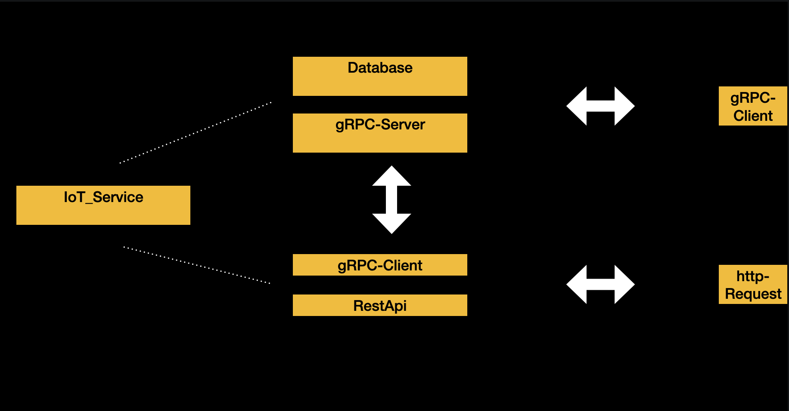

# IoT_Service
A backend service to collect data from devices.\
Written in  Go.

### Contains: 
* DatabaseHandler
* gRPC-Server
* RestAPI-Server

### How to use ?

* ##### run the commands in root folder:
    #### Dependency: [Go 1.14.7]( https://golang.org/).

        go mod init IoT_Service
        go get
        go build

* Create a Docker Container with ["PostgreSQL"](https://hub.docker.com/_/postgres).
* Configure the "configFile.yml".
* Run the IoT_Service.

#### Simple connection configuration:
configFile.yml
```yaml
db:
  host: "localhost"
  port: "5432"
  dialect: "postgres"
  user: "postgres"
  db_name: "IoT"
  password: "postgres"

gRPC:
  host: "localhost"
  port: "50051"
  network_type: "tcp"

api:
  host: "localhost"
  port: "8080"
  gRPCHost: "localhost"
  gRPCPort: "50051"
```
### db:

#### you can change the DB-Dialect to
* mysql
* sqlite
* postgres

### api:
should be the same as in the section of "gRPC".
* gRPCHost
* gRPCPort

######

## What can you do ?
* Device
  * create
  * update
  * delete
  * get

* Sensor
  * create
  * update
  * delete
  * get
* Record
  * create
  * update
  * delete
  * get

* Record-Data
  * create
  * delete
  * get

#
### Individualize Device:
#### Types:

Type         | Number |
------------ | ------ |
Arduino      | 0      |
RaspberryPi  | 1      |
PLC_Siemens  | 2      |
PLC_Beckhoff | 3      |
PLC_WAGO     | 4      |


#### Example Device:
Name         | Location | DeviceType    | IPAddress      | Gateway       | SubnetMask      |
------------ | -------- | ------------- | -------------- | ------------- | --------------- |
Arduino      | Office   | 0 [Arduino]   | "192.168.1.27" | "192.168.1.1" | "255.255.255.0" |


### Individualize Sensor:
#### DataTypes:

Type        | Number |
----------- | ------ |
BOOL        | 0      |
BYTE        | 1      |
INT         | 2      |
FLOAT       | 3      |
DOUBLE      | 4      |
STRING      | 5      |
DATETIME    | 6      |

#### GPIOType:
###### Only for Device:
* Arduino
* RaspberryPi

Type            | Number |
--------------- | ------ |
Input           | 0      |
Output          | 1      |
AnalogInput     | 2      |
AnalogOutput    | 3      |

#### PLCDataArea:
###### Only for Device:
* PLC_Siemens
* PLC_Beckhoff
* PLC_WAGO

Type    | Number |
------- | ------ |
DB      | 0      |
MK      | 1      |
PE      | 2      |
PA      | 3      |
CT      | 4      |


#### Example Sensor:
DeviceID    | Name          | Location      | DataType      | GPIONum       | GPIOType          | PullUpResistor |
----------- | ------------- | ------------- | ------------- | ------------- | ----------------- | -------------- |
1           | Temperature   | Kitchen       | 2 [INT]       | 0             | 2 [AnalogInput]   | false          |


### Individualize Record:
* Interval in seconds
* #### RecordType RecordSensor:

Type            | Number    | SensorDataType                        |
--------------- | --------- | ------------------------------------- |
EQUAL           | 0         | ALL                                   |
ODD             | 1         | ALL                                   |
SMALLER_THEN    | 2         | ALL                                   |
BIGGER_THEN     | 3         | ALL                                   |
RANGE           | 4         | ALL without [ STRING  DATETIME BOOL ] |
ALWAYS          | 5         | ALL                                   |


#### Example Record:
* A Record can have multiple Sensor.

DeviceID    | Name                  | Running   |
----------- | --------------------- | --------- |
1           | Temperature_Kitchen   | true      |

#### Example RecordSensor:
SensorID    | RecordType    | TriggerValueMin   | TriggerValueMax   | Interval(seconds)     |
----------- | ------------- | ----------------- | ----------------- | --------------------- |
1           | 4 [RANGE]     | 15                | 45                | 5                     |


### Individualize Search RecordData:
#### FilterTime:

Type        | Number |
----------- | ------ |
NOW         | 0      |
LAST_24H    | 1      |
LAST_WEEK   | 2      |
LAST_MONTH  | 3      |
LAST_3MONTH | 4      |
LAST_6MONTH | 5      |
LAST_YEAR   | 6      |
ALL         | 7      |

#### FilterValue:

Type                | Number |
------------------- | ------ |
EQUAL_VALUE         | 0      |
ODD_VALUE           | 1      |
SMALLER_THEN_VALUE  | 2      |
BIGGER_THEN_VALUE   | 3      |
RANGE_VALUE         | 4      |
ALL_VALUE           | 5      |


#### Example RecordDataFilter:
RecordID    | SensorID  | FilterValue       | MinValue  | MaxValue  | FilterTime        |
----------- | --------- | ----------------- | --------- | --------- | ----------------- |
1           | 1         | 3 [BIGGER_THEN]   | 25        |           | 4 [LAST_3MONTH]   |

## You can work with:

### HTTP-Request / Response:

````json
Content-Type application/json

//Create Device:
POST http://localhost:8080/device
{
    "Name": "Arduino",
    "Location": "Office",
    "DeviceType": 0,
    "IPAddress": "192.168.1.27",
    "Gateway": "1192.168.1.1",
    "SubnetMask": "255.255.255.0",
}
// Update Device:
PATCH http://localhost:8080/device
{
    "ID" : 1,
    "Name": "Arduino",
    "Location": "Office-Changed...",
    "DeviceType": 0,
    "IPAddress": "192.168.1.27",
    "Gateway": "1192.168.1.1",
    "SubnetMask": "255.255.255.0",
}

// Delete Device:
DELETE http://localhost:8080/device
{"ID": 1}

// Get Device:
GET http://localhost:8080/device
{"ID": 1}
// Response:
{
    "ID": 1,
    "Name": "Arduino",
    "Location": "Office",
    "DeviceType": 0,
    "IPAddress": "192.168.1.27",
    "Gateway": "192.168.1.1",
    "SubnetMask": "255.255.255.0"
}

// Get all Devices:
GET http://localhost:8080/devices
{}
// Response [STREAM]:
{
    "ID": 1,
    "Name": "Arduino",
    "Location": "Office",
    "DeviceType": 0,
    "IPAddress": "192.168.1.27",
    "Gateway": "192.168.1.1",
    "SubnetMask": "255.255.255.0"
}

// Create Sensor:
POST http://localhost:8080/sensor
{
    "DeviceID": 1,
    "Name": "Temperature",
    "Location": "Kitchen",
    "DataType": 2,
    "GPIONum": 0,
    "GPIOType": 2,
    "PullUpResistor": false
}

// Update Sensor:
PATCH http://localhost:8080/sensor
{
    "DeviceID": 1,
    "Name": "Temperature",
    "Location": "Kitchen_Changed...",
    "DataType": 2,
    "GPIONum": 0,
    "GPIOType": 2,
    "PullUpResistor": false
}

// Delete Sensor:
DELETE http://localhost:8080/sensor
{"ID": 1}

// Get Sensor:
GET http://localhost:8080/sensor
{"ID": 1} // "SensorID"
// Response:
{
    "ID": 1,
    "DeviceID": 1,
    "Name": "Temperature",
    "Location": "Kitchen",
    "DataType": 2,
    "GPIONum": 0,
    "GPIOType": 2,
    "PullUpResistor": false,
}

// Get all Sensors:
GET http://localhost:8080/sensors
{"ID": 1} // "DeviceID"
// Response [STREAM]:
{
    "ID": 1,
    "DeviceID": 1,
    "Name": "Temperature",
    "Location": "Kitchen",
    "DataType": 2,
    "GPIONum": 0,
    "GPIOType": 2,
    "PullUpResistor": false,
}

// Create Record:
POST http://localhost:8080/record
{
    "DeviceID": 1,
    "Name": "Temperature_Kitchen",
    "Running": true,
    "RecordSensor":
    [
        {
            "SensorID": 1,
            "RecordType": 4,
            "TriggerValueMin": "15",
            "TriggerValueMax": "45",
            "interval": 5
        },

        {
            "SensorID": 1,
            "RecordType": 5,
            "interval": 360
        },

    ]
}

// Update Record:
PATCH http://localhost:8080/record
{
    "ID": 1,
    "Name": "Temperature_Kitchen_Changed...",
    "Running": false,
}

// Delete Record:
DELETE http://localhost:8080/record
{"ID":1} // "RecordID"

// Get Record:
GET http://localhost:8080/record
{"ID":1} // "RecordID"
// Response:
{
    "ID":1,
    "DeviceID": 1,
    "Name": "Temperature_Kitchen",
    "Running": true,
    "RecordSensor":
    [
        {
            "SensorID": 1,
            "RecordType": 4,
            "TriggerValueMin": "15",
            "TriggerValueMax": "45",
            "interval": 5
        },

        {
            "SensorID": 1,
            "RecordType": 5,
            "interval": 360
        },
    ]
}

// Get all Records:
GET http://localhost:8080/records
{"ID":1} // "DeviceID"
// Response [STREAM]:
{
    "ID":1,
    "DeviceID": 1,
    "Name": "Temperature_Kitchen",
    "Running": true,
    "RecordSensor":
    [
        {
        "SensorID": 1,
        "RecordType": 4,
        "TriggerValueMin": "15",
        "TriggerValueMax": "45",
        "interval": 5
        },

        {
            "SensorID": 1,
            "RecordType": 5,
            "interval": 360
        },
    ]
}

// Create RecordData:
POST http://localhost:8080/record_data
{
    "ID": 1, // "RecordID"
    "SensorID": 1,
    "Value": "34"
}

// Delete RecordData:
DELETE http://localhost:8080/record_data
{
    "ID": 1, // "RecordID"
    "SensorID": 1
}

// Get RecordData:
GET http://localhost:8080/record_data
{
    "ID": 1, // "RecordID"
    "SensorID": 1,
    "FilterValue": 3,
    "MinValue": "25",
    "FilterTime": 4
}
// Response [STREAM]:
{
    "ID": 1,
    "SensorID": 1,
    "DataType": "INT",
    "Value": "27",
    "Timestamp": "2021-09-11T23:08:14.983Z"
}
````
## gRPC-Client

you can build your own gRPC-Client in the project-folder contains [ProtoFile](./proto/IoT.proto) (Examples coming soon.)

You can look for inspiration in [routes](./server/services/gRPC/routes.go)

or look on [gRPC](https://grpc.io/)

Test the gRPC-Server with
[Kreya](https://kreya.app/)


## Tasks:

- [ ] Add client examples
    - [ ] Arduino
    - [ ] RaspberryPi
    - [ ] PLC_Siemens
    - [ ] PLC_Beckhoff
    - [ ] PLC_WAGO
    - [ ] OPC
- [ ] Add secure option

- [ ] Add Repository IoT_Manager
  * in work.
  * written in C++ with Qt.

## Schema Application


